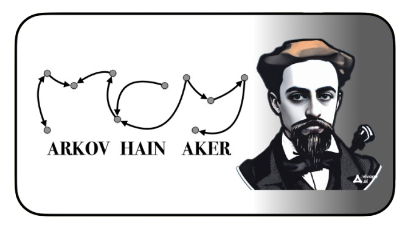

<a id="readme-top"></a>

<!-- PROJECT SHIELDS -->

[![LinkedIn][linkedin-shield]][linkedin-url]
[![MIT License][license-shield]][license-url]
[![Forks][forks-shield]][forks-url]
[![Stargazers][stars-shield]][stars-url]
[![Contributors][contributors-shield]][contributors-url]

<!-- PROJECT LOGO -->
<br />
<br />
<div align="center">
  <a href="https://github.com/PTJ-07/MarkovChainMaker">
    
  </a>
</div>

<!-- TABLE OF CONTENTS -->
<br />
<details>
  <summary>Table of Contents</summary>
  <ol>
    <li>
      <a href="#about-the-project">About The Project</a>
      <ul>
        <li><a href="#built-with-(-Acknowledgements-)">Built With ( Acknowledgements )</a></li>
      </ul>
    </li>
    <li>
      <a href="#tutorial-for-use">Tutorial for use</a>
      <ul>
        <li><a href="#installation">Installation</a></li>
        <li><a href="#purpose">Purpose</a></li>
        <li><a href="#available-functions">Available Functions</a></li>
      </ul>
    </li>
    <li><a href="#autor">Autor</a></li>
    <li><a href="#license">License</a></li>
    <li><a href="#contact">Contact</a></li>
    <li><a href="#considerations">Considerations</a></li>
  </ol>
</details>

<!-- ABOUT THE PROJECT -->
## About The Project


<b>------ ENGLISH ------</b>

This tiny App have been created as a tool for all these students who are curious about 
the Markov Chain Behaviour, more specifically, its behaviour within any Discrete Domain.
Thanks to this App, students will be able to create all Markov Chains they want, and then, 
it also allowed to perform three types of options, which are ;

<i>{ M.Chain Summary, M.Chain Probability operations, M.Chain Delete }</i>

To Finish, this App is available in three languages;

<i>{ Spanish ( by default ) , English , Italian }</i>

<p align="right">(<a href="#readme-top">back to top</a>)</p>


<b>------ ESPAÑOL ------</b>

Esta pequeña aplicación ha sido creada como una herramienta para todos aquellos estudiantes 
que sientan curiosidad por el comportamiento de las Cadenas de Markov, más específicamente, 
su comportamiento dentro de cualquier dominio discreto. Gracias a esta aplicación, los estudiantes 
podrán crear todas las Cadenas de Markov que deseen, y después, también se les permitirá realizar 
tres tipos de opciones, las cuales son;

<i>{ Resumen de C.Markov, Operaciones de probabilidad de la C.Markov, Eliminación de la C.Markov }</i>

Para finalizar, dicha aplicación estará disponible en tres idiomas;

<i>{ Español ( por defecto ), Inglés , Italiano }</i>

<p align="right">(<a href="#readme-top">back to top</a>)</p>


<b>------ ITALIANO ------</b>

Questa piccola App è stata creata come strumento per tutti quegli studenti che sono curiosi 
del comportamento della catena di Markov, più specificatamente, del suo comportamento all'interno
di qualsiasi dominio discreto. Grazie a questa App, gli studenti saranno in grado di creare tutte
le catene di Markov che desiderano, e poi, si permetterà anche di eseguire tre tipi di opzioni che sono;

<i>{ M.Chain Riepilogo, Operazioni di probabilità di C.Markov, Eliminazione di C.Markov }</i>

Per finire, questa App è disponibile in tre lingue;

<i>{ L'Spagnolo (di default), L'Inglese, L'Italiano }</i>

<p align="right">(<a href="#readme-top">back to top</a>)</p>


### Built With ( Acknowledgements )


<b>EN :</b> Before going any further, I would like to express my sincere thanks to the following entities, since 
it is thanks to their various educational resources that this small but wonderful project has been possible:

<b>ES :</b> Antes de proseguir, me gustaría mostrar mi más sincero agradecimiento a los siguientes entes, puesto que
gracias a sus recursos didácticos de diversa índole se ha podido llevar a cabo este pequeño pero maravilloso proyecto :

<b>IT :</b> Prima di proseguire, vorrei esprimere i miei più sinceri ringraziamenti alle seguenti entità, poiché è grazie 
alle loro diverse risorse didattiche che è stato possibile realizzare questo piccolo ma meraviglioso progetto:

<br />

* [![R][r-project.org]][R-url] :<br />
<b>EN :</b> Functions that enable the calculations that have taken place <br />
<b>ES :</b> Funciones que posibilitan los cálculos acontecidos <br />
<b>IT :</b> Funzioni che permettono di effettuare i calcoli che si sono svolti
                                 
* [![Youtube][youtube.com]][youtube-url] : <br />
<b>EN :</b> Tutorial in Spanish on the creation and uploading of R packages to Github<br />
<b>ES :</b> Tutorial sobre la creación y subida a Github de paquetes R<br />
<b>IT :</b> Tutorial sulla creazione e sul caricamento dei pacchetti R su Github
                                           
* [![GitHub][github.com]][github-url] :<br />
<b>EN :</b> Professional and original template for `README` files<br />
<b>ES :</b> Plantilla profesional y original para archivos `README`<br />
<b>IT :</b> Modello professionale e originale per i file `README`
                                        
* [![Vivago][vivago.ai]][vivago-url] : <br />
<b>EN :</b> AI creation of Andrei Markov's portrait.<br />
<b>ES :</b> Creación mediante IA del retrato de Andréi Márkov.<br />
<b>IT :</b> Creazione AI del ritratto di Andrei Markov.

<p align="right">(<a href="#readme-top">back to top</a>)</p>

<!-- TUTORIAL FOR USE -->
## Tutorial for use

### Installation


<b>EN :</b> Although the `matrix`,`expm`, and `markovchain` packages are required, the installation of this package should a
priori be sufficient for the correct functioning of the package. Here are the commands to perform the download:

<b>ES :</b> Pese a que se requiere de los paquetes `matrix`,`expm`, y `markovchain`, la instalación de dicho paquete debería 
ser a priori suficiente para el correcto funcionamiento del mismo. He aquí los comandos para llevar a cabo la descarga: 

<b>IT :</b> Sebbene siano necessari i pacchetti `matrix`, `expm` e `markovchain`, l'installazione di questo pacchetto dovrebbe 
essere sufficiente a priori per il suo corretto funzionamento. Ecco i comandi per eseguire il download:

```r
install.packages("pak")
pak::pak("PTJ-07/MarkovChainMaker")
library(MarkovChainMaker)
```

<p align="right">(<a href="#readme-top">back to top</a>)</p>

### Purpose


<b>------ ENGLISH ------</b>

The MarkovChainMaker application is mainly a small and short interactive interface on which the following actions 
can be performed PER SESSION : 

Once logged in the SESSION ( == execute the following command ) : `CADENA_DE_MARKOV()`

* <b>1. Creation of Markov Chains</b>: Manual and sequential input of the data that will define the transition matrix of your Markov Chain. This chain can be saved.
* <b>2. Possible operations</b> : Both for the visualisation and for the calculation on the Markov Chains created.
* <b>3. Deletion of Markov Chains</b> : On-demand deletion of those Markov Chains created earlier in the session.
* <b>4. Exit the App</b>: That is, the session will be closed, LOSING all the DATA COLLECTED in it.

<i>Note</i> : Everything shown above is the main menu of the application.

<p align="right">(<a href="#readme-top">back to top</a>)</p>


<b>------ ESPAÑOL ------</b>

La aplicación MarkovChainMaker se trata principalmente de una pequeña y breve interfaz interactiva sobre la cual se pueden 
llevar a cabo las siguientes acciones POR SESIÓN : 

Una vez iniciada sesión ( == ejecutar el siguiente comando ) : `CADENA_DE_MARKOV()`

* <b>1. Creación de Cadenas de Markov</b> : Introducción manual y secuencial mente de aquellos datos que definirán la matriz de transición de su Cadena de Markov. Dicha cadena puede quedar guardada.
* <b>2. Operaciones Posibles</b> : Tanto para la visualización como para el cálculo sobre las Cadenas de Markov creadas.
* <b>3. Eliminación de Cadenas de Markov</b> : Supresión a la carta de aquellas Cadenas creadas con anterioridad en la sesión.
* <b>4. Salir de la App</b>: Es decir, la sesión se cerrará, PERDIÉNDOSE todos los DATOS RECOLECTADOS en ella

<i>Nota</i> : Todo lo mostrado anteriormente se trata del Menú Principal de la Aplicación

<p align="right">(<a href="#readme-top">back to top</a>)</p>


<b>------ ITALIANO ------</b>

L'applicazione MarkovChainMaker è principalmente una piccola e breve interfaccia interattiva sulla quale è possibile 
eseguire le seguenti azioni PER SESSIONE: 

Una volta effettuato il login nella SESSIONE  ( == eseguire il seguente comando ) : `CADENA_DE_MARKOV()`

* <b>1. Creazione di catene di Markov</b>: inserimento manuale e sequenziale dei dati che definiranno la matrice di transizione della catena di Markov. La catena di Markov può essere salvata.
* <b>2. Operazioni possibili</b>: visualizzazione e calcolo delle catene di Markov create.
* <b>3. Eliminazione delle catene di Markov</b>: eliminazione su richiesta delle catene di Markov create in precedenza nella sessione.
* <b>4. Uscita dall'applicazione</b>: la sessione viene chiusa, perdendo tutti i dati raccolti.

<i>Nota</i>: Tutto ciò che è mostrato sopra è il menu principale dell'applicazione.

<p align="right">(<a href="#readme-top">back to top</a>)</p>

### Available Functions

<b>------ ENGLISH ------</b>

Although the focus of this package is on the simulation of a small app, however, you will also have access to a number of
functions if you only want to focus on data collection. The following available functions are:

* A.`CREACIÓN_DE_CADENA_DE_MARKOV`: Creates the M.Chain from the data entered for your transition matrix.
* B.`RESULTADOS`: Displays important calculations on the M.Chain like expected mean, stationary matrix ( if any ), ect...
* C.`OPERACIONES`: Performs probabilistic transition calculations.
* D.`is_true`: Checks if a Boolean vector consists of all `TRUE`.

<i>Note</i> : Functions B. and C. are only executed if a Markov Chain has been created before with function A.

If you want more information about the same functions, execute the following command such as: `?FunctionName_language`.

Example : `?RESULTADOS_english`.

<p align="right">(<a href="#readme-top">back to top</a>)</p>


<b>------ ESPAÑOL ------</b>

Pese a que el objetivo de esta paquete estriba en la simulación de una pequeña app, sin embargo, también se dará acceso a una
serie de funciones si sólo se desea centrarse en las labores de recolección de datos. Sean las siguientes funciones disponibles:

* A.`CREACIÓN_DE_CADENA_DE_MARKOV`: Crea la C.Markov a partir de los datos introducidos para su matriz de transición
* B.`RESULTADOS`: Visualiza cálculos importantes sobre la C.Markov como media esperada, matriz estacionaria ( si la hay ), ect..
* C.`OPERACIONES`: Realiza cálculos probabilisticos de transición
* D.`is_true`: Verifica si un vector de tipo Booleano está conformada por todo `TRUE`.

<i>Nota</i> : Las funciones B. y C. sólo se ejecutran si antes se ha creado una cadena con la función D.

Si se desea más información acerca de las mismas funciones ejecute el siguiente comando tal que: `?NombreFunción_idioma`.

Ejemplo : `?RESULTADOS_español`

<p align="right">(<a href="#readme-top">back to top</a>)</p>


<b>------ ITALIANO ------</b>

Sebbene l'obiettivo di questo pacchetto sia la simulazione di una piccola applicazione, è possibile accedere a una serie di funzioni anche se ci si vuole concentrare solo sulla raccolta dei dati. Le funzioni seguenti sono:

* A.`CREACIÓN_DE_CADENA_DE_MARKOV`: crea la C.Markov dai dati inseriti per la matrice di transizione.
* B.`RESULTADOS`: Visualizza i calcoli importanti sulla C.Markov, come la media attesa, la matrice stazionaria (se presente) e così via.
* C.`OPERACIONES`: Esegue calcoli di transizione probabilistica.
* D.`is_true`: Verifica se una stringa booleana è composta da tutti `TRUE`.

<i>Nota</i>: le funzioni B. e C. vengono eseguite solo se una Catena di Markov è stata creata in precedenza con la funzione A.

Se si desiderano ulteriori informazioni sulle stesse funzioni, eseguire il comando seguente, ad esempio: `?NomeFunzione_lingua`.

Esempio: `?RESULTADOS_italiano`.

<p align="right">(<a href="#readme-top">back to top</a>)</p>


<!-- AUTOR -->
## Autor

Pablo Torres Jiménez, Carlos III student of 4th year Statistics and Business Degree ( 2024 )

<br />
<div align="left">
  <a href="https://www.linkedin.com/in/pablo-torres-jiménez-629349269/">
    
  </a>
  <a href="https://www.uc3m.es/bachelor-degree/statistics-business">
    
  </a>
</div>

<p align="right">(<a href="#readme-top">back to top</a>)</p>

<!-- LICENSE -->
## License

Distributed under the MIT License. See `LICENSE.md` for more information.

<p align="right">(<a href="#readme-top">back to top</a>)</p>

<!-- CONTACT -->
## Contact

* [![Mi_Linkedin][mi_linkedin-shield]][linkedin-url] : Professional use

* [![Mi_GitHub][mi_github.com]][mi_github-url] : Academic use

* ![Mi_Gmail][mi_gmail.com] : Personal use

<p align="right">(<a href="#readme-top">back to top</a>)</p>
<!-- CONSIDERATIONS-->
## Considerations

<b>------ ENGLISH ------</b>

Note that you have to take into account that :

* This package will not usually be updated

* For MarkovChainMaker to work properly, the markovchain package must be available.

* ( Future Considerations )

<p align="right">(<a href="#readme-top">back to top</a>)</p>


<b>------ ESPAÑOL ------</b>

Note que se debe de tener en cuenta que :

* Este paquete no se actualizará normalmente

* Para que MarkovChainMaker funcione correctamente, el paquete markovchain debe estar disponible.

* ( Consideraciones futuras )

<p align="right">(<a href="#readme-top">back to top</a>)</p>


<b>------ ITALIANO ------</b>

Si noti che è necessario tenere in considerazione che :

* Questo pacchetto di solito non viene aggiornato

* Perché MarkovChainMaker funzioni correttamente, il pacchetto markovchain deve essere disponibile.

* ( Considerazioni future )

<p align="right">(<a href="#readme-top">back to top</a>)</p>

<br />
<b>LAST UPDATE</b> : `9_November_2024`
<br />
<br />

<!-- MARKDOWN LINKS & IMAGES -->

[linkedin-shield]: https://img.shields.io/badge/PabloTorres-black.svg?style=for-the-badge&logo=linkedin&colorB=555
[linkedin-url]: https://www.linkedin.com/in/pablo-torres-jiménez-629349269/

[license-shield]: https://img.shields.io/github/license/PTJ-07/MarkovChainMaker.svg?style=for-the-badge
[license-url]: https://github.com/PTJ-07/MarkovChainMaker/blob/master/LICENSE.md#mit-license

[forks-shield]: https://img.shields.io/github/forks/PTJ-07/MarkovChainMaker.svg?style=for-the-badge
[forks-url]: https://github.com/PTJ-07/MarkovChainMaker/network/members

[stars-shield]: https://img.shields.io/github/stars/PTJ-07/MarkovChainMaker.svg?style=for-the-badge
[stars-url]: https://github.com/PTJ-07/MarkovChainMaker/stargazers

[contributors-shield]: https://img.shields.io/github/contributors/PTJ-07/MarkovChainMaker.svg?style=for-the-badge
[contributors-url]: https://github.com/PTJ-07/MarkovChainMaker/graphs/contributors


[r-project.org]: https://img.shields.io/badge/Markochain-black?style=for-the-badge&logo=r&#45projectdotorg&logoColor=white
[R-url]:https://cran.r-project.org/web/packages/markovchain/index.html

[youtube.com]:https://img.shields.io/badge/Estadistica_util-black?style=for-the-badge&logo=youtube&logoColor=white
[youtube-url]:http://www.youtube.com/@estadistica_util

[github.com]:https://img.shields.io/badge/othneildrew-black?style=for-the-badge&logo=github&logoColor=white
[github-url]:https://github.com/othneildrew

[vivago.ai]:https://img.shields.io/badge/Vivago.ai-black?style=for-the-badge&logo=https://vivago.ai/_nuxt/logo_new.Df7-Y4Mq.svg&logoColor=white
[vivago-url]:https://vivago.ai/home


[mi_linkedin-shield]: https://img.shields.io/badge/PabloTorres-black?style=for-the-badge&logo=linkedin&logoColor=white

[mi_github.com]:https://img.shields.io/badge/PTJ07-black?style=for-the-badge&logo=github&logoColor=white
[mi_github-url]:https://github.com/PTJ-07


[mi_gmail.com]:https://img.shields.io/badge/Pablo.Torres.Jimenez.07@gmail.com-black?style=for-the-badge&logo=gmail&logoColor=white
